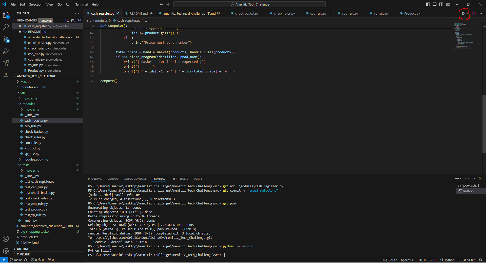

# Amenitiz_Tech_Challenge
This project has been created to carry out the technical challenge from the enterprise Amenitiz for a junior vacant.

## Getting started
This project has been developed using python following the instructions from the file ```amenitiz_technical_challenge_(1).md``` that can be found in the project. In the following sections it is shown how it can be installed, executed and tested.

## Prerequisites
To install everything that is needed, you require the following things:
- VSCode
- Python 3.13.0
- Python, Pylance, Python Debugger and Black Formatter from the Extensions from VSCode
- Git
- For confort you can also install Github Desktop, but it is optional

## Installation
Once we have all the prerequisites:
- We clone our github repository (we choose the folder that we want to have it): https://github.com/git-guides/git-clone
- We open the project in VSCode (where we had our cloned repository): https://simpledev.io/lesson/open-a-project-folder-vs-code-1/
- We select the python interpreter (3.13.0): https://code.visualstudio.com/docs/python/python-tutorial#_install-a-python-interpreter
- We configure VSCode for the testing: https://code.visualstudio.com/docs/python/testing
  
Take into account that sometimes the environment variables and Path can cause problems, so this link can be helpful: https://docs.python.org/3/using/windows.html

## Code structure
The way I organized the code after some changes was the following:

```
src\
    \modules
    \tests
```
```__init__.py``` files and ```setup.py``` are used mostly to stablish the folders hierarchy and to make the project work. The ```setup.py``` file generated folders like ```module.egg-info```.

This way, I kept the modules and code on one folder and the tests into another.
This code followed the the principles of TDD to test our code, but when it was at it's very beggining, the testing wasn't done with unit tests (those were added later), it was done with the terminal, making sure that every new piece of code was doing what it was intended, even though this part could be improved.
Also it followed the single-responsability principle. In order to avoid difficult debugging of errors and a lot of code bloating, the code has been separated in many sections and files. Most of this files have one job only, so if one error is spotted there, it does not cause problems in more classes and files.
Also this last thing makes it easier to extend, read, maintain. Also it is simpler to have a many tiny functions that can be carefully analized instead of a single file with 2000 lines of code.
So with this advantatges, it can have more functionalities introduced in the future, and those will have a solid base to follow better TDD principles.


## How it works

To execute the code, we mush have open ```cash_register.py```, that it can be considered our main program. To do so we must press the triangle at the top right of the screen, that will appear after the setup and installation it is done. The following image shows it:



Once that is done the program will start. This cash register works with a terminal (CLI), so one will appear in the bottom of the screen:


The way we introduce our data is that we first insert the identifier of the product, press intro key, then the name, press intro key and price plus intro key. Once we introduced all of that, the screen will show the product that we have scanned:


We can do this indefinitely until we press intro key that contains nothing, then the program will understand that that client finished his shopping and no more products are introduced, so it will compute the total purchase, showing the price of the shopping and the list of products that the client bought:


The cash register does not close because more clients can need it, so it resets the price that was having and starts again. Only in can be close if it recieved the code: ```close_cash_register``` and an empty intro
The way that it works is that once we have introduced all the items (the products created with the ```Product``` class, who encapsulated the information in a format of a python class), it computes it's price, taking special care to the Green Tea, Strawberries and Coffee. It separates them and returns what they cost based on the rules introduced by the CEO, the COO and the VP. To understand the rules of the modules that handle this:
- ```CEO_rule.py``` recieves and array of products that are green_teas, and sees if the buy-one-get-one-free can be applied. If we recieve 0 or 1 green teas, we just return the price of this 0 or 1 green teas. If the number of green teas in total is even, we return the priced halved in 2, for the discount. In case it is odd, making one not having it's discount, we multiply the price of a green_tea x the number of green_teas we have (the array) minus 1 and add the price of one green tea (the one withot a couple)
- ```COO_rule.py``` recieves and array of products that are strawberries, and sees if the bulk purchase can be applied. If we recieve 0 to 2 strawberries, we just return the price accumulated. If not, it checks if the number of strawberries that we have is multiple of 3, meaning that the bulk purchases can be done. If not it makes it that we store the price of the the strawberries that cannot be grouped and then computes the price for those that can have the discount. Then the formula for the price goes like this: 4.5 (price of the strawberries) * 3 (the pack of strawberries) * size of array (the number of strawberries (at this point has to be multiple of 3)) divided per 3. This last division it is to get the number of packs of 3 of strawberries. Example if we have a pack of 7 strawberries:

```
[SR1 SR1 SR1] [SR1 SR1 SR1] SR1 = [4.5 x 3] + [4.5 x 3] + 5 = 4.5 x 3 x 2 + 5
```

Here we have 2 bulk purchases of strawberries, meaning that 6/3 = 2
- ```VP_rule.py``` recieves and array of products that are coffies, and sees if the 2/3 discount can be applied. If we recieve 0 to 2 coffies, we just return the price accumulated. If not, it checks if the number of coffies that we have is multiple of 3, meaning that the 2/3 discounts can be done. If not it makes it that we store the price the coffies that cannot be grouped and then computes the price for those that can have the discount. To do this we multiply the price of one coffee x the size of the array (the total of coffies) * 2 and divide it by 3 (the 2/3 discount)

The files ```check_rules.py``` and ```check_basket.py``` are used to compute the special rules and the final basket respectively.

## Tests structure
The tests are kept inside the folder of ```tests/```. Each module has it's own test to run it.
To do it I used ```unittest``` library, with the root project and to automatically select files that start with ```test_*.py```.
The tests for cash_register.py are quite different since they are used to test the input, so to access any other test you need to place yourself in the tests library and type in a console the following:

```
python3 -m unittest name_of_the_file.NameOfTheClass
```

Example:

```
python3 -m unittest  test_check_basket.TestCheckBasket
```

If you want to run all this test without experiencing the issues of the input tests, it can be done by placing yourself inside src/tests/ and executing the following command:

```
python3 -m unittest test_check_basket.TestCheckBasket test_check_rules.TestCheckRules test_ceo_rule.TestCEORule test_coo_rule.TestCOORule test_vp_rule.TestVPRule test_product.TestProduct
```

To run the tests from cash_register.py, to see if the program inputs data correctly, they are done one by one like this:

```
python3 -m unittest  test_cash_register.TestCashRegister.test_name_of_the_test
```

Example:

```
python3 -m unittest  test_cash_register.TestCashRegister.test_one_product
```

Where the last parameter is the name of the method. Each method has its parameters that are introduced when the console is running. To clarify, after one input, intro key has to be pressed to go to the next input (like in the cash register) and a '' is the equivalent to press intro key without wrinting anything (the way the program understands that something is finished). Doing this can be a bit tedious, so that is why the prior command was created, to tackle more independently the input testing, but quickly testing the rest of the methods.

## Versions
It hasn't been added a versioning system, the track of the changes it is in the commit history.

## Author
- Oriol Cardona Alsina
